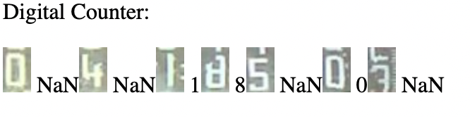
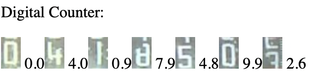
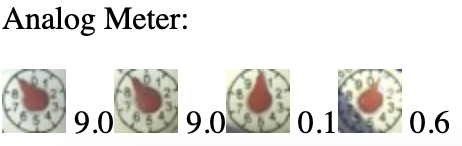

# Model Selection

!!! Notes
    See [Neural Network Types](../Neural-Network-Types) for additional details.

In the [Graphical Configuration Page](../Graphical-configuration), you can choose different models depending on your needs.

This page tries to help you on which model to select.
For more technical/deeper explanations have a look on [Neural-Network-Types](../Neural-Network-Types).

## Digit Models

For digits on water meters, gas-meters or power meters you can select between two main types of models.

### dig-class11

This model can recognize full digits. All intermediate states shown a "N" for not a number. But in post process it uses older values to fill up the "N" values if possible.

{: style="width:300px"}

#### Main features

* well suited for LCD digits
* with the ExtendedResolution option is not supported. (Only in conjunction with ana-class100 / ana-cont)

### dig-class100 / dig-cont

These models are used to get a continuous reading with intermediate states. To see what the models are doing, you can go to the Recognition page.

{: style="width:300px"}

#### Main features

* suitable for all digit displays.
* Advantage over dig-class11 that results continue to be calculated in the transition between digits.
* With the ExtendedResolution option, higher accuracy is possible by adding another digit.

Look [here](https://jomjol.github.io/neural-network-digital-counter-readout) for a list of digit images used for the training 

#### dig-class100 vs. dig-cont
The difference is in the internal processing. Take the one that gives you the best results.

## Analog pointer models

### ana-class100 / ana-cont

For pointers on water meters use the analog models. You can only choose between ana-class100 and ana-cont. Both do mainly the same.

{: style="width:250px"}

#### Main features

* for all analogue pointers, especially for water meters.
* With the ExtendedResolution option, higher accuracy is possible by adding another digit.

Look [here](https://jomjol.github.io/neural-network-analog-needle-readout/) for a list of pointer images used for the training

#### ana-class100 vs. ana-cont
The difference is in the internal processing. Take the one that gives you the best results. Both models learn from the same data.

## Different types of models (normal vs. quantized)

The normally trained network is calculating with internal floating point numbers. The saving of floating point numbers naturally takes more space than an integer type. Often the increased accuracy is not needed. Therefore there is the option, to "quantize" a neural network. In this case the internal values are rescaled to integer values, which is called "quantization". The stored tflite files are usually much smaller.
Usually the models are distrusted therefore in both versions. They can be distinguished by a "-q" at the end of the logfile.

#### Example:

| Type      | Name                        |
| :-------- | --------------------------- |
| Normal    | `dig-cont_0610_s3.tflite`   |
| Quantized | `dig-cont_0610_s3-q.tflite` |