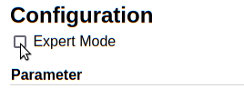
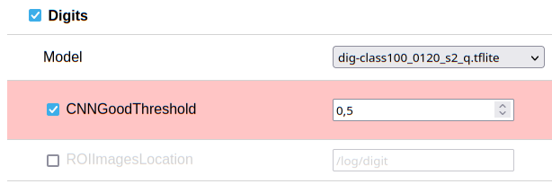

# Graphical Configuration
Most of the settings can be modified on the Settings page:


It can be reached via the menu `Settings > Configuration`.

!!! Note
    - To activate the changes, the device needs to be restarted after saving the changes.
    - Most of the commands need processing on the ESP32 device. This is not very fast - so please be patient.

All parameters are documented on the [Parameters](../Parameters) page and as tooltips on the config page.

## Expert Parameters
Some parameters are treated as **Expert Parameters** and are hidden by default.
Tick the checkbox in the top left corner to enable them:

  

The **Expert Parameters** then will be shown with a red background:
  

## Manual Editing of the Config File
Even more configuration parameters can be edited manually in the `config.ini`:

  

To edit the `config.ini` file directly, click on the `Edit Config.ini directly` button.

## Background Information

!!! Note
    You do not need to understand this!
    But you might be interested in it.

The principle is very simple and can most easily be described as a flow of processing steps. Each step has a dedicated parameter description in the ``config.ini``, which is indicated by brackets ```[name_of_step]```. The steps are processed in the order written in the config file. That means, that you first have to describe the image taking, then the aligning and cutting and only after that you can start to config a neural network. The last step is the post processing.

###  Processing steps - Overview
In the following you get a short overview over the available steps. This order is also the suggested order for the processing flow. Single steps can be left out, if not needed (e.g. omit the analog part, if only digits are present)

#### 1. ``[TakeImage]``
This steps parametrises the taking of the image by the ESP32-CAM. Size, quality and storage for logging and debugging can be set.

#### 2. ``[Alignment]``
Image preprocessing, including image alignment with reference images

#### 3. ``[Digits]``
Neural network evaluation of an image for digits. The neural network is defined by a tflite formatted file and the output is a number between 0 .. 9 or NaN (if image is not unique enough)

#### 4. ``[Analog]``
Neural network evaluation of analog counter. The neural network is defined by a tflite formatted file and the output is a number between 0.0 .. 9.9, representing the position of the pointer.

#### 5. ``[PostProcessing]``
Summarized the individually converted pictures to the overall result. It also implements some error corrections and consistency checks to filter wrong reading.

#### 6. ``[MQTT]``
Transfer of the readings to a MQTT server.

#### 7. ``[AutoTimer]``
Configuration of the automated flow start at the start up of the ESP32. 

#### 8. ``[Debug]``
Configuration for debugging details
