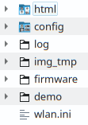

# Installation
The installation requires multiple steps:

1. Get the right hardware and wire it up
1. Flash the firmware onto the ESP32
1. Write the data to the SD card
1. Start it

For point 2 and 3 we provide multiple ways to do it. Pick the one that looks the easiest for you!

## 1. Hardware
### ESP32-CAM
* OV2640 camera module
* Micro SD card slot 
* 4 or 8 MB PSRAM. 

It can be easily found on the typical internet stores, searching for ESP32-CAM for less than 10 EUR.
How ever since the hardware is cheap and coming from China, you unluckily could pick a malfunctioning device. See [Hardware Compatibility](../Hardware-Compatibility) for further advice! 

### USB->UART interface
For first time flashing the firmware a USB -> UART connector is needed. Later firmware upgrades than can be flashed via OTA.

### Power supply
For power supply a 5V source is needed. Most easily this can be done via a USB power supply. The power supply should support minimum 500mA. For buffering current peaks some users reported to use a large electrolytic capacitor like a 2200uF between ground and VCC.

**:bangbang: Attention:** in several internet forums there are problems reported, in case the ESP32-CAM is only supplied with 3.3V.

### Housing
A small 3D-printable example for a very small case can be found in Thingiverse here: [https://www.thingiverse.com/thing:4571627](https://www.thingiverse.com/thing:4571627)

{: style="width:200px"}
{: style="width:200px"}

**:bangbang: Attention**: the focus of the OV2640 needs to be adjusted, as it is normally set from ~40cm to infinity. In order to get an image that is big enough, it needs to be changed to about 10cm. Therefore the sealing glue on the objective ring needs to be removed with a scalpel or sharp knife. Afterwards the objective can be rotated clockwise until the image is sharp again.

{: style="width:200px"}

### Wiring
Beside the 5V power supply, only for the first flashing a connection to the USB-UART connector, including a short cut of GPIO0 to GND for bootloader start.

A example for wiring can be found here:


It is also possible to use external LEDs for the illumination instead of the internal flash LED. This is described [here](../External-LED)

## 2. Firmware
### Web Installer
There is a Web Installer available which will work right out of the web browser Edge and Chrome.
You can access it with the following link: [Web Installer](https://jomjol.github.io/AI-on-the-edge-device)

**This is the preferred way for beginners** as it also allows access to the USB Log:

[](img/web-console.png)


### Manual Flashing
#### Files
Grab the firmware from the

 - [Releases page](https://github.com/jomjol/AI-on-the-edge-device/releases) (Stable, tested versions), or the
 - [Automatically build development branch](https://github.com/jomjol/AI-on-the-edge-device/actions?query=branch%3Arolling) (experimental, untested versions). Please have a look on [Living on the Edge](../rolling-installation) first!

You need:

*   partitions.bin
*   bootloader.bin
*   firmware.bin


#### Flashing using the Flash Tool from Espressif (GUI)
Get the [Flash Download Tool](https://www.espressif.com/en/support/download/other-tools) from Espressif.

Download and extract the Flash tool, after starting choose "Developer Mode", then "ESP32-DownloadTool" and you are in the setup of the flashing tool. Connect the ESP32-CAM with the USB-UART connection and identify the COM-Port. 

:bangbang: **Attention**: if you are re-flashing the code again, it is strongly recommended to erase the flash memory before flashing the firmware. Especially if you used OTA in between, which might cause remaining information on the flash, to still boot from an old image in the OTA-area, which is not erased by a normal flash.

But your ESP32 in bootloader mode and push start, then it will identify the board and you can configure the bin-configuration according to the following table:

| Filename       | Offset  |
|----------------|--------:|
| bootloader.bin | 0x1000  |
| partitions.bin | 0x8000  |
| firmware.bin   | 0x10000 |


#### Flashing using the Python based esptool (Console)
For this you need a python environment (e.g. Anaconda in Win10). 
Here you need to install the esptool:

```
pip install esptool
```
Then connect the ESP32 with the USB-UART connector to the system, put it in boot mode and with the following command you can erase the flash and flash bootloader, partitions and firmware in two steps:

```
esptool erase_flash
esptool write_flash 0x01000 bootloader.bin 0x08000 partitions.bin 0x10000 firmware.bin
```
- Maybe you need to specify the COM-port if it is not detected by default.
- If the erase command throws the error `A fatal error occurred: ESP32 ROM does not support function erase_flash.`, your `esptool` might be too old, see <https://techoverflow.net/2022/02/08/how-to-fix-esp32-a-fatal-error-occurred-esp32-rom-does-not-support-function-erase_flash/>

With some Python installations this may not work and you’ll receive an error, try `python -m pip install esptool` or `pip3 install esptool`.

Further recommendations can be found on the [espressif webpage](https://docs.espressif.com/projects/esptool/en/latest/esp32/installation.html).

## 3. SD Card
The software expects an SD card prepared with certain directory and file structure in order to work properly.
SD card most top directory should look like this:

  

This initial setup needs only to be done **once** as further updates (Firmware as well as SD card content) are possible with the [Over-The-Air Update](ota.md) mechanism.

#### Notes
- Due to the limited availability of GPIOs (OV2640, Flash-Light, PSRAM & SD card) the communication mode to the SD card is limited to 1-line SD-Mode. It showed up, that this results in problems with very large SD-Cards (64GB, sometimes 32 GB) and some no name low cost SD-cards.
- There must be no partition table on the SD-card (no GPT, but only MBR for the single partition)
- Following setting are necessary for formatting the SD-card: **SINGLE PARTITION, MBR, FAT32 - 32K.  NOT exFAT**
- Some ESP32 devices share their SD-card and/or camera GPIOs with the pins for TX and RX. If you see errors like “Failed to connect” then your chip is probably not entering the bootloader properly. Remove the respective modules temporarily to free the GPIOs for flashing. You may find more information about troubleshooting on the [homepage of Espressif](https://docs.espressif.com/projects/esptool/en/latest/esp8266/troubleshooting.html).

**The ESP32 indicates problems with the SD card during startup with a fast, endless blinking.**
**In this case, please try another SD card.** 

### Manual Setup with an SD Card Reader on a PC
1. Take the `AI-on-the-edge-device__manual-setup__*.zip` from the [Release](https://github.com/jomjol/AI-on-the-edge-device/releases) page.
1. Open it and extract the `sd-card.zip`.
1. Open it and extract all files onto onto your SD card.
1. On the SD card, open the `wlan.ini` file and configure it as needed:
    - Set the corresponding SSID and password
    - The other parameters are optional

  **Note:** The device provides a File Server which can be used to show, edit or delete the files on the SD card. For security reasons, the `wlan.ini` file is excluded from this and is hidden from external access to protect the password.

After this, you can insert the SD card into the ESP32 board and start it.

### Remote Setup using the built-in Access Point
On startup of the ESP32, it checks if the `wlan.ini` or the `config/config.ini` are available on the SD card.
If not, the ESP32 switches to a special mode. In this mode, it provides a Wifi Access Point which can be used to add the missing `wlan.ini` or the `config/config.ini` file.

1. Take the `AI-on-the-edge-device__remote-setup__*.zip` from the [Release](https://github.com/jomjol/AI-on-the-edge-device/releases) page.
1. Connect to Access Point of the device. The SSID is "AI-on-the-Edge" and you can access it without any password:

    

    The device has the following fixed IP: [http://192.168.4.1](http://192.168.4.1).

1. Upload initial configuration to SD card

    

    Use the `select file` and `upload` button to start the upload.
    A warning will show up if you have chosen a possible wrong file (without default configuration).

1. Store WLAN access information.

    After the upload, a new page will be shown:

    

    Enter your SSID and password.

    **Note:** Only basic settings are supported. If you need advanced configuration (fixed ip, ...), you need to use the manual setup as documented above.

    **:bangbang: Attention:**

    - Carefully check your wifi settings. To change them later on, you need to take out the SD card and edit the `wlan.ini` manually (or delete it and start again).
    - The information is transferred without encryption!

    Finish the step by pushing `Write wlan.ini`

1. Reboot

    The final step is the reboot:

    


    **:bangbang: Warning:**
    It will take up to 3 minutes. Afterwards you can find your device in the local network. Check your router for the IP. You can find it also in the USB Console output.


## 4. Initial Startup
After the firmware is flashed and the SD card is setup properly, you can start it.
After power on the connection status is indicated by 3x blinking of the red on board LED.

WLAN-Status indication:

* **5 x** fast blinking (< 1 second): connection still pending
* **3 x** slow blinking (1 second on/off): WLAN connection established

**Note:** It is normal that at first one or two times a pending connection is indicated.
