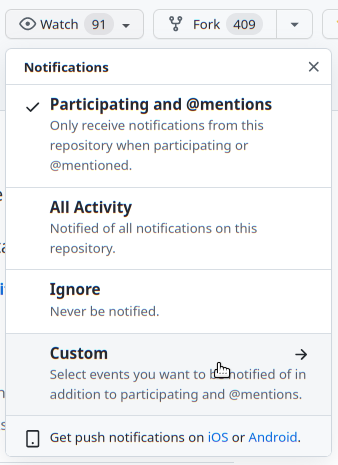

# Notification about new Releases

Do you want to get notified about a new release?
Use the aproach documented below.

## Github Notifications

You will need a Github Account for this!

1. Log into your Github account on [Github](https://github.com).
1. Go to [AI-on-the-edge-device](https://github.com/jomjol/AI-on-the-edge-device).
1. On the top right side, click onto `Watch` and select `Custom`:
      
1. Select `Releases`.

You will get an email when a new release gets created.

See also [Github Documentation](https://docs.github.com/en/account-and-profile/managing-subscriptions-and-notifications-on-github/managing-subscriptions-for-activity-on-github/viewing-your-subscriptions).
