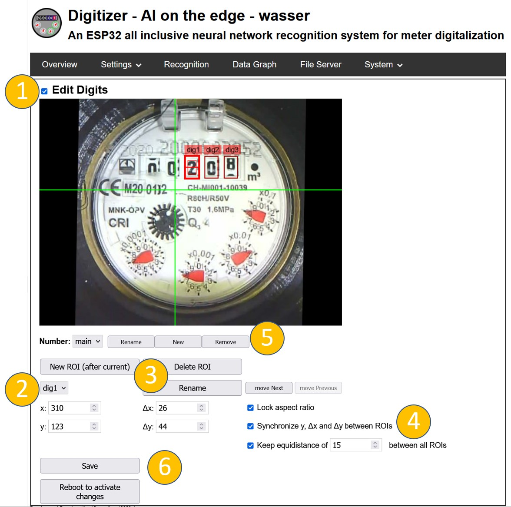
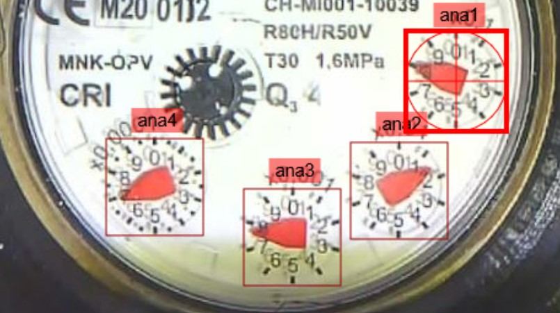
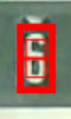
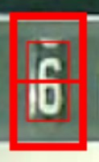

# ROIs (Regions of Interest)

!!! Notes
    You are using a neural network approach which is trained to fit as many different type of meters as possible.
    The accuracy will never be 100%. It is normal to see a missing reading once in a while. 
    There are several precautions to detect this. For details see the section `PostProcessing` on the configuration page.

The most critical components for an accurate detection are:

1. Correct setting of the **R**egions **O**f **I**nterest (ROIs) for detection of the image.

    **This must be done manually for each device/installation!**

2. Using a well trained Model.
   
    Have a look on the [Digital Counters](https://jomjol.github.io/neural-network-digital-counter-readout/) resp. [Analog Needles](https://jomjol.github.io/neural-network-analog-needle-readout) to check if your types are contained. If your number types are **not** contained, you should take the effort to record them so we can add them to the training data. See [Collect images to improve the models](../Learn-models-with-your-own-images) on how to collect new training data.

## Precondition
Please make sure to have:

1. Setup your camera properly and taken a good [Reference Image](../Reference-Image).
1. Selected good [Alignment References](../Alignment).

## Define the ROIs
For each digit or analog pointer, a ROI must be defined.

You can even have multiple independent **Numbers** (eg. electerical meters mostly have 2 numbers for the high and low tariff). 

Depending if you have only one of those types, you can enable/disable `(1)` it on the top left corner: 

{: style="width:500px"}

You can switch between the individual ROIs with the Drop down box `(2)`.
If you need additional ROIs or delete them you can do this with the control at `(3)`.
Like for the [Alignment References](../Alignment), you can change the position, size and name of a ROI in the text fields or define them via drag and drop through the mouse button. 
Make sure the ROIs are in the right order, matching the significance of a digit/analog counter!

!!! Warning
    The order of the ROIs defines how the individual digits are combined to the total number. The first ROI is the digit with the highest order (left side), then the second and so on. You can control the order in the selector tab and change it with the buttons `"move Next"` or `"move Previous"`.

In most cases **digits** are ordered equidistantly (have the same distance between each other) and have the same size.
Bcause of this the Web Interface keeps their sizes and distance the same.
If you need individual sizes or distances, untick the settings `(4)`.

In almost all cases the sizes and `y` values should be identical!
The ratio between `x` and `y` might need adjustment. But make sure it is the same for all digits.

Same for the **analog counters**, the sizes should be identical and the `x` and `y` as well.

!!! Note
    Don't forget to save the settings with "Save" and do not reboot at this stage.

### Analog Counters
For analog counters the ROI setting is rather straight forward as the meter is usually quadratic with a clear center.
The circle should exactly fit to the outer size of the meter and the cross should be in the middle of the pointer.

Here is an example with the details for the ROI `ana1`: 

{: style="width:500px"}

### Digits
For the Digital Meters it is a little bit more complicated, as there are different options of digital models which can be choosen.

#### Correct Size for ROI
First of all, choose the right size of the ROI.
The configuration of ROIs differs a bit on the selected model (see below). 

If you are in the initial setup, the model will be selectable in the next step. By default it is a `dig-cont` resp. `ana-cont` model.

In [Model Selection](../Choosing-the-Model) you find the differences between the different available models. Pick the one you think fits best your purpose. If you don't get to good result, try another model.

Here we only show the different configuration of the ROIs.

1. Digital Meters with only recognized full digits (`0, 1, 2, 3, ... 9`)

    Suggested Model: `dig-class11-*.tfl`

    **Advantage:** broad variety of types included in the training.

    **Disadvantage:** partially rotated numbers cannot be detected.

2. Digital Meters with sub-digit resolution (`0.0, 0.1, 0.2, .... 9.8, 9.9`)

    Suggested Model: `dig-cont-*.tfl` or `dig-class100-*.tfl`

    **Advantage:** partial numbers can be detected and a better post processing is possible.

    **Disadvantage:** only limited types of meter types are trained due to the high effort for the training data.

#### How to setup the digit ROIs perfectly
Details and the corresponding "perfect" setting is explained below.
For a first run you can choose the following general settings: 

* There is an inner and an outer frame for the ROIs. 
* Make the inner frame exactly the size of the number.

| |Example 1|Example 2|
|---|---|---|
| :heavy_check_mark: **Okay** |   {: style="width:80px"}  |   {: style="width:80px"}     |
| :x: **Not** Okay            | {: style="width:80px"} |  {: style="width:80px"} |
| :x: **Not** Okay            | {: style="width:80px"}|  {: style="width:80px"}|

##### Setup using `dig-class11` models
`dig-class11` - Models recognize the **complete digit only**. Here it is not relevant if the ROI fits the Border of the digit window.

For this model, there should be a border of `20%` of the image size around the number itself. This border is shown in the ROI setup image by the inner thinner rectangle. This rectangle should fit perfectly around the number when the number has not started to rotate to the next position: 

|              | Example 1                         | Example 2                         |
| ------------ | --------------------------------- | --------------------------------- |
| :heavy_check_mark: **Okay**     |            |            |
| :x: **Not** Okay |  |  |
| :x: **Not** Okay |    |    |

If you have perfect alignment and still are not getting satisfying results, most probably your numbers are not part of the training data yet. See [Collect images to improve the models](../Learn-models-with-your-own-images) on how to collect new training data.

##### Setup using `dig-class100` or `dig-cont` Models

These models recognize the **tenths** (fractions) between the numbers.
Those models require a different ROI setup; **the height must be set differently and more accurately**.

First, the width can be set like for a `dig-class11` model, i.e. `20%` margin left and right.

The height of the outer rectangle should be set to the upper and lower edge of the number window. To achieve this, you might need to unlock the aspect ratio:

Here an example:

|              | Example 1                         | 
| ------------ | --------------------------------- | 
| :heavy_check_mark: **Okay**     |           | 
| :x: **Not** Okay |  | 

### Saving
Once you are done,  push `Save` to persist your setup.

A reboot is required to apply the changed configuration!
