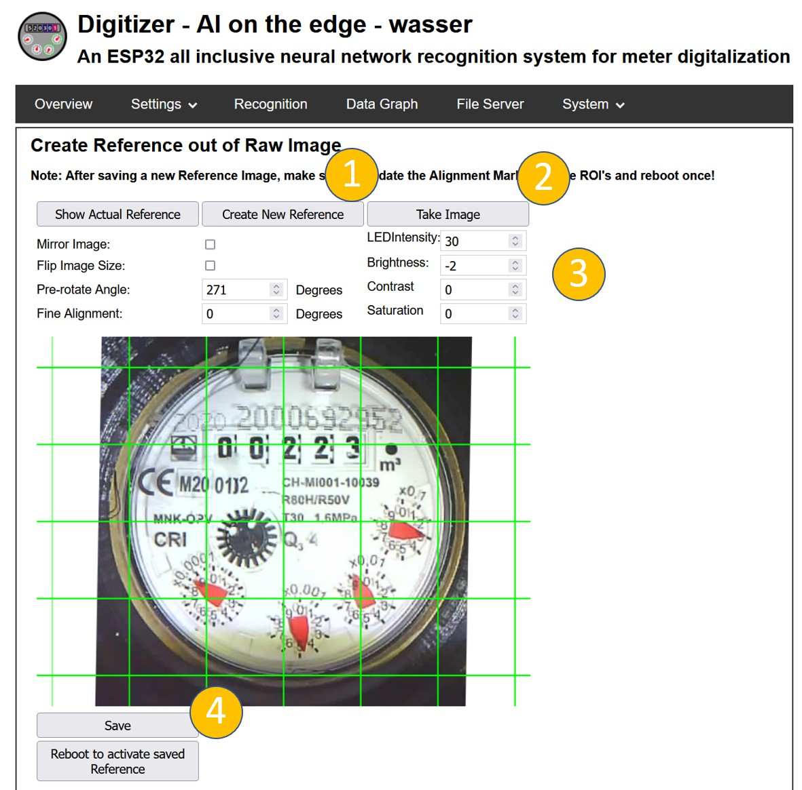
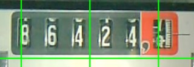
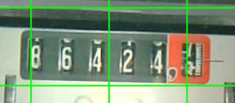
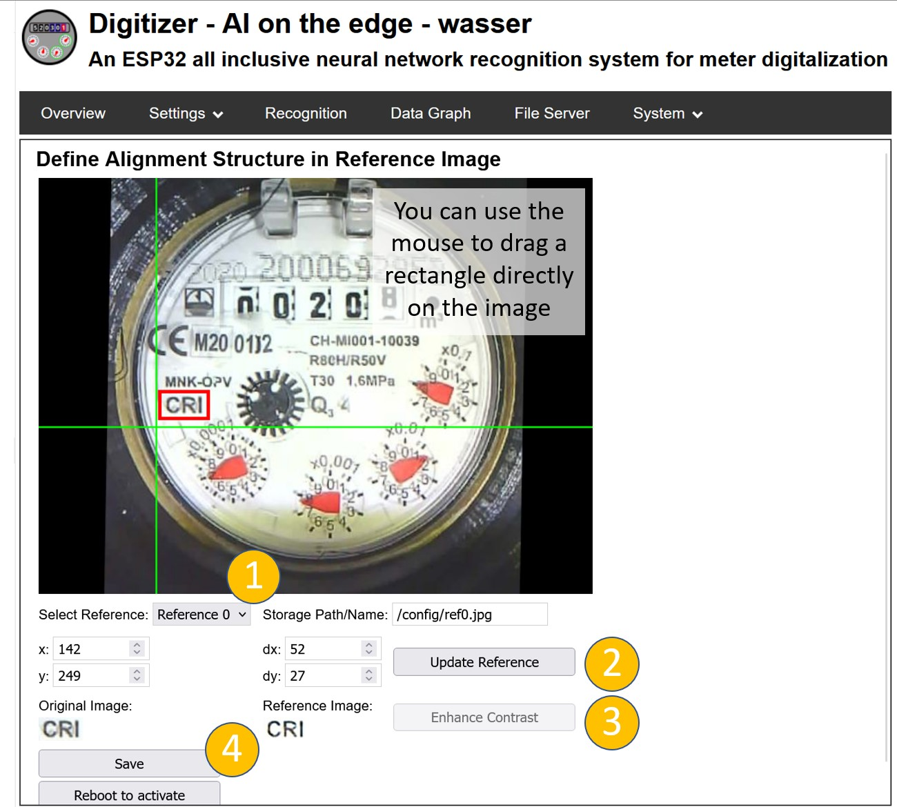
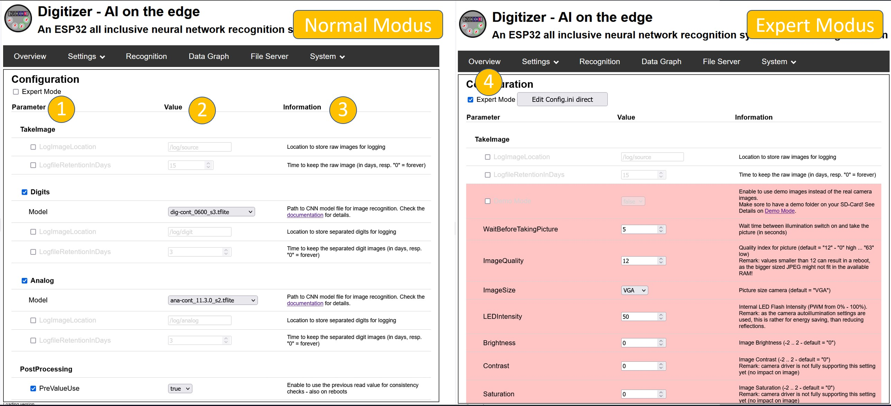

# Initial Setup

After setting up the device (firmware, sd-card, wlan) the device will connect to the wifi access point and start in an initial setup configuration:

In the top you can navigate through 5 steps, that guide you through the necessary setup. All settings can be accessed also later in the normal operation mode (see below).

## 1. Reference Image

The reference image is the basis for the coordinate system of the ROIs. Therefore it is very important, to have a well aligned image, that is not rotated. 

At first the current image is shown. To define a new reference image push the button "Create new Reference" (2) and afterwards "Take Image" (2). It might take some seconds for processing, then your actual camera image should be shown.

**Attention:** This is the first time, where you have access to the camera image. It might not be sharp yet. This is the first thing to do according to the following instruction (**TBD**).

#### Correct Horizontal Alignment

Ensure an **exact horizontal alignment** of the number via the alignment / reference setup:

| :heavy_check_mark: Okay     | :x: Not Okay                    |
| --------------------------- | ------------------------------- |
|  |  |

**:bangbang: Attention:** Updating the reference image, also means, that all alignment images and ROIs needs to be teached again. Therefore do this step later only with caution.

If everything is done, you can save the result with "Update Reference Image" (4). Please do not reboot at this stage, but go to the next section.

## 2. Alignment References

The alignment references are used to realign every taken image to the reference coordinates. Therefore two alignment structures are identified and the image is shifted and rotated according to their position with the target to be in exactly the same position as the reference image. The alignment structures needs to be unique and have a good contrast. You can switch between this two marks with (1).

With the control in (3) position and size of the selected reference image. You can define the ROI in the image also directly via drag and drop with the mouse. To choose the currently marked image part you need to push "Update Reference" (2). 

In some cases it might be useful to use a reference with a higher contrast. This can be achieved by pushing "Enhance Contrast" (3). The result will be calculated on the ESP32 - so be a bit patient, before you see it active.

To save the push finally "Save to config.ini" (4). Do not reboot at this stage, but proceed with the "next" button.

## 3./4. Define the ROIs for the number detection

Here the regions of interest for the digital and analog pointers are defined. As both are done identically, here as an example the digital images are shown.

### General usage

First of all, if you don't have that kind of numbers on you meter, you can disable it with the check box at the top (1).

In contrast to the reference images, here there are more ROIs possible. You can switch between them with the drop down box (2). If you need additional ROIs or delete them you can do this with the control at (2). 

**Attention:** The order of the ROIs defines, how the indiviual digits are combined to the total number. The first ROI is the digit with the highest order, then the second and so on. You can control the order in the selector tab and change it with the buttons "move Next" or "move Previous".

As for the reference images you can change position, size and name of the ROI in the text fields or define them via drag and drop through the mouse button. 

In most cases the digits are ordered in a aequidistant order and have the same size, you can synchronize them with the control in (4).

Don' t forget to save the settings with "Save" and do not reboot at this stage.

### Detail for ROI configuration - Analog Meters

For analog meters the ROI setting is rather straight forward as the meter is usually quadratic with a clear center. The circle should exactly fit to the outer size of the meter and the cross should be in the middle.

Here is an example with the details for the ROI "ana1": 

### Detail for ROI configuration - Digital Meters

For the digital meters it is a little bit more complicated, as there are different options of digital models, that you can choose.

1. Digital meter, that only recognized full digits (0, 1, 2, 3, ... 9) - Naming: `dig-class11-....tfl`
   **Advantage:** broad variety of types included in the training
   **Disadvantage:** partially rotated numbers cannot be detected
2. Model with subdigit resulition (0.0, 0.1, 0.2, .... 9.8, 9.9) - Naming: `dig-cont-....tfl` or `dig-class100-....tfl`
   **Advantage:** partial numbers can be detected and a better post processing is possible
   **Disadvantage:** only limited types of meter types are trained due to the high effort for the training data

Details and the corresponding "perfect" setting is explained here: [Details ROI Configuration](https://jomjol.github.io/AI-on-the-edge-device-docs/ROI-Configuration/)

For a first run you can choose the following general settings: 

* There is an inner and an outer frame for the ROIs. 
* Make the inner frame exactly the size of the number.

| |Example 1|Example 2|
|---|---|---|
| :heavy_check_mark: **Okay** |     |          |
| :x: **Not** Okay            |   |   |
| :x: **Not** Okay            |  |  |

## 5. General Settings

In the next steps you can configure the behavior and external interfaces in detail:

The configuration is divided into different sub topics:

* TakeImage
* Digits
* Analog
* PostProcessing
* MQTT
* InfluxDB
* GPIOSettings
* Autotimer
* DataLogging
* Debug
* System

The details are explained in other parts of the manual (see links (**TBD**))

Some of the sections as well as parameters are mandatory. They can be en/disabled in the first column (1). 
The setting itself is done in the next column (2) and a brief explanation you can find in the last column (3).

Don' t forget to save the settings with "Save" and do not reboot at this stage.

#### Expert Modus

With the normal parameters you should be able to make the needed settings for most of the system. Sometimes there is some fine tunning needed. For this there is an expert modus available. This can be enabled with the check box at the top (4). After this you see much more parameters. But before modifiying them you should be really sure, what they are about.

## Finish Setup and change to normal operation

After setting up everything, there is a last step to be done:

With (1) you leave the setup modus and reboot to normal operation mode.

## Access to setup in normal operation mode

You can access all the settings also during the normal working mode via the "Settings" menue:

(1) Access to configuration parameters

(2) Update of reference image

(3) Update of alignment marks

(4)/(5) Update of the ROI setting
