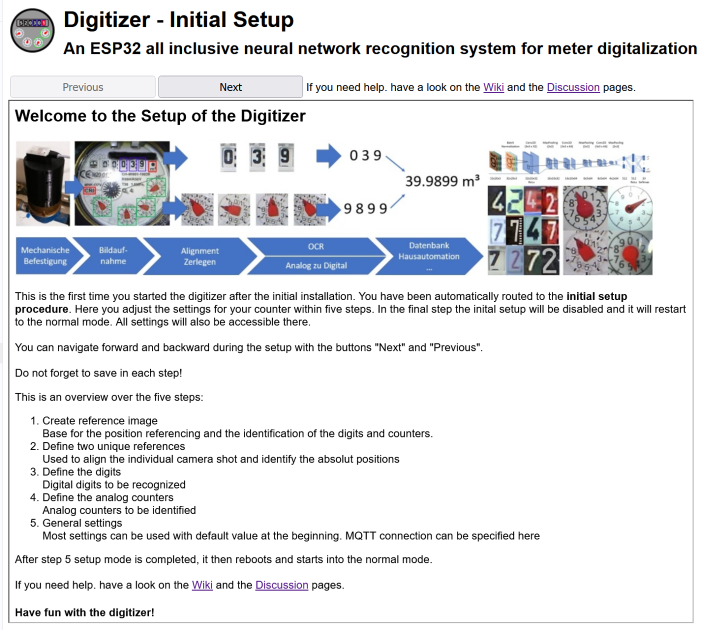
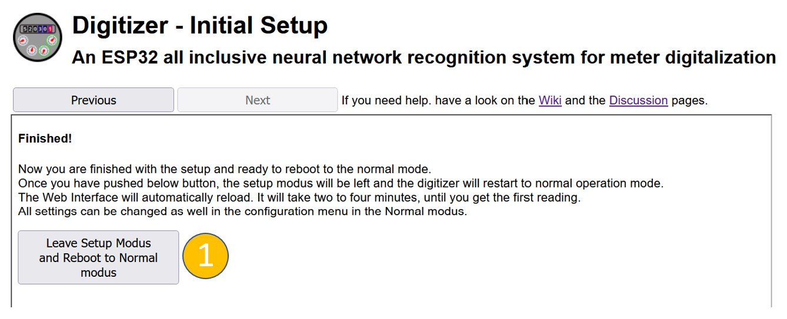
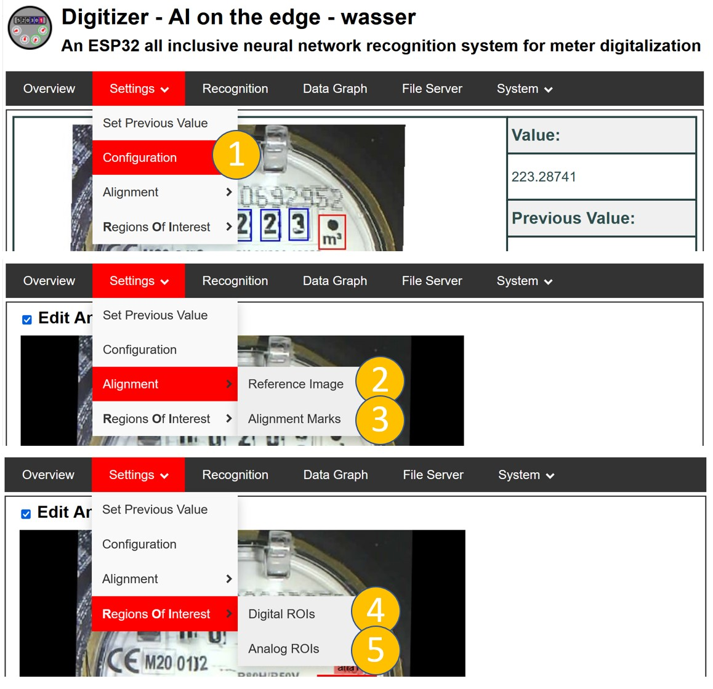

# Initial Setup

After setting up the device (firmware, SD card, WLAN) the device will connect to the wifi access point and start in an initial setup configuration:

{: style="width:500px"}

With the buttons on the top you can navigate through 5 steps which guide you through the necessary setup:

1. Create the [Reference Image](Reference-Image.md). It is the base for the position referencing and the identification of the digits and counters.
1. Define two unique [References](Alignment.md). It is used to align the individual camera images and identify the absolut positions.
1. Define the [Digital ROIs](ROI-Configuration.md) to be recognized. (Only required in case your meter has analoge pointers).
1. Define the [Analog ROIs](ROI-Configuration.md) to be identified</li>
1. [General Settings](Configuration.md). Most settings can be used with default value at the beginning.

All settings can be accessed also later in the normal operation mode.

!!! Note
    Don' t forget to save each step with "Save" and do not reboot at this stage.

## Finish the Setup and change to the Normal Operation mode
With the last step `(1)` you leave the **Setup Mode** and reboot to the **Normal Operation mode**.

{: style="width:500px"}

## Access to the Setup Pages in the Normal Operation mode
You always can access all the settings during the normal operation mode via the `Settings` menu:

{: style="width:500px"}

- `(1)` Access to the [General Settings](Configuration.md).
- `(2)` Update of the [Reference Image](Reference-Image.md).
- `(3)` Update of the [Alignment Marks](Alignment.md).
- `(4)/(5)` Update of the [ROIs](ROI-Configuration.md).
